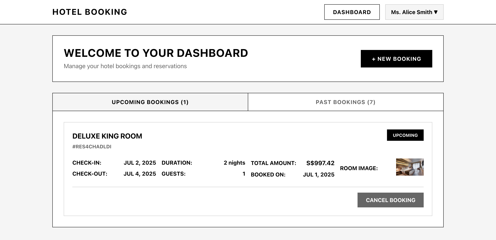

# Hotel Booking Flow with User Login

A full-stack hotel booking application with user authentication, room search, booking management, and a user dashboard. Built with a Laravel (PHP) backend and a React + TypeScript + Vite frontend.

---

## Features

- User registration and login
- Room search with pagination
- Room selection and booking flow
- Booking confirmation with guest details
- User dashboard to view and manage bookings
- API-driven frontend and backend integration
- Dockerized for easy deployment

---

## Project Structure

```
hotel-booking-flow-with-user-login/
  backend/      # Laravel API backend
  frontend/     # React + Vite frontend
  docker/       # Docker and Nginx configs
  docker-compose.yml
```

---

## Prerequisites

- Docker & Docker Compose (for containerized setup)
- Node.js & npm (for local frontend dev)
- PHP & Composer (for local backend dev)

---

### Backend (Laravel)

```sh
cd backend
cp .env.example .env
composer install
php artisan key:generate
php artisan migrate --seed
php artisan serve
```

- The backend will run at `http://localhost:8000` by default.

### Frontend (React + Vite)

```sh
cd frontend
cp .env.example .env
npm install
npm run dev
```

- The frontend will run at `http://localhost:3000` by default.
- Set the API URL in `.env`:
  ```
  VITE_API_URL=http://localhost:8000
  ```

---

## Dockerized Setup

1. **Set environment variables** in `frontend/.env` and `backend/.env` or via Docker Compose (see below).
2. **Build and start all services:**
   ```sh
   docker-compose up --build
   ```
3. **Access the app:**
   - Frontend: [http://localhost:3000](http://localhost:3000)
   - Backend API: [http://localhost:8000/api](http://localhost:8000/api)

### Example `docker-compose.yml` (snippet)

```yaml
services:
  backend:
    build: ./backend
    ports:
      - "8000:8000"
    # ...
  frontend:
    build: ./frontend
    ports:
      - "3000:3000"
    environment:
      - VITE_API_URL=http://localhost:8000
    # ...
```

---

## Environment Variables

- **Frontend:**
  - `VITE_API_URL` — The base URL for the backend API (e.g., `http://localhost:8000` or your production URL)
- **Backend:**
  - Standard Laravel `.env` variables (DB, mail, etc.)

---

## Deployment Notes

- For production, set `VITE_API_URL` to your backend's public URL in Docker Compose or your deployment environment.
- Rebuild the frontend after changing environment variables.

---

## Screenshots





## License

MIT
